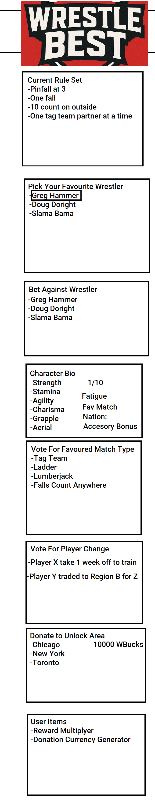
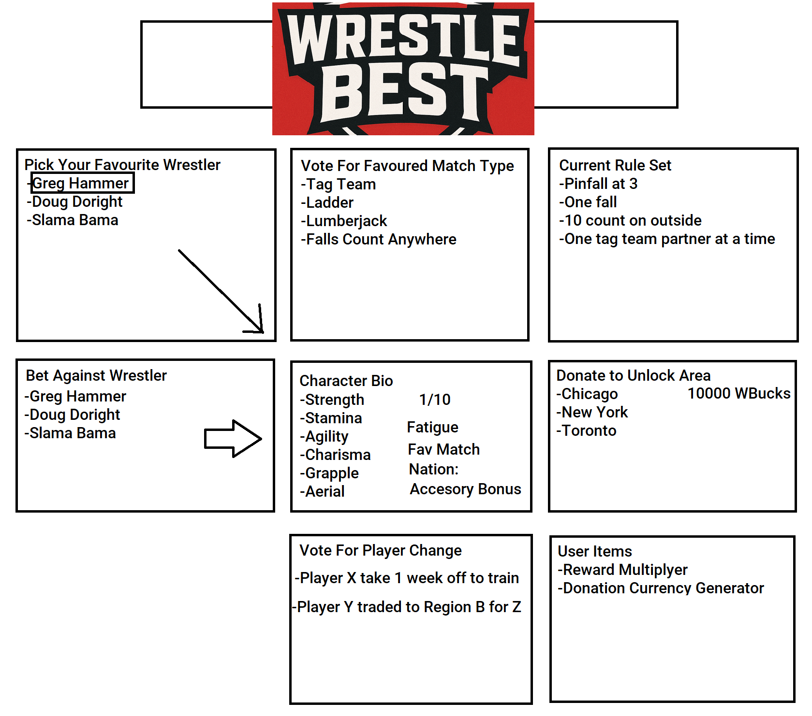

# WrestleBest
WrestleBest The Game

> Description
WrestleBest is a game where you vote for simulated wrestlers on who will win and who will lose. Players select their favourite winner and favoruite loser. There are several matches per day, and the more they win or lose the more you win. Rewards allow users to unlock features like playing in other regions or changing the rules of wrestling matches. Communal donations unlock other nations, or features like match types, or selecting multiple wrestlers. The game increases in scope as more is unlocked by player involvement. 
> Live demo [_here_](https://www.example.com). <!-- If you have the project hosted somewhere, include the link here. -->

## Table of Contents

- [General Info](#general-information)
- [Technologies Used](#technologies-used)
- [Features](#features)
- [Screenshots](#screenshots)
- [Setup](#setup)
- [Usage](#usage)
- [Project Status](#project-status)
- [Room for Improvement](#room-for-improvement)
- [Acknowledgements](#acknowledgements)
- [Contact](#contact)
<!-- * [License](#license) -->

## General Information

- Provide general information about your project here.
- What problem does it (intend to) solve?
  Bordem. A game for people
- What is the purpose of your project?
  To learn mechanics like
  - user profiles
  - voting
  - virtual currency
  - game design
  - database web interactions
- Why did you undertake it?
  This was in scope with some skills I wanted to learn about. 
<!-- You don't have to answer all the questions - just the ones relevant to your project. -->

Players have traits like
Alignment: Good, Bad, Tweener
* Strength (1-10)
* Stamina (1-10)
* Agility (1-10)
* Charisma (1-10)
* Grapple (1-10)
* Aerial (1-10)
* Fatigue (1-10)
* Fav Match type (1-10)
* Home City Bonus
* Accessory Bonus
* Manager Bonus 

## Technologies Used

- Tech 1 - version 1.0
-   Node.JS
- Tech 2 - version 2.0
-   Javascript
- Tech 3 - version 3.0

## Frameworks/Libraries
- JavaScript
- Node.js
- HTML
- CSS

## How To Run
- HTML webpage

## Features

List the ready features here:

- Awesome feature 1
- Awesome feature 2
- Awesome feature 3

## Screenshots

<!-- If you have screenshots you'd like to share, include them here. -->

## Setup

What are the project requirements/dependencies? Where are they listed? A requirements.txt or a Pipfile.lock file perhaps? Where is it located?

Proceed to describe how to install / setup one's local environment / get started with the project.

## Usage

How does one go about using it?
Provide various use cases and code examples here.

`write-your-code-here`

## Project Status

Project is: _in progress_ / _complete_ / _no longer being worked on_. If you are no longer working on it, provide reasons why.

## Room for Improvement

Include areas you believe need improvement / could be improved. Also add TODOs for future development.

Room for improvement:

- Improvement to be done 1
- Improvement to be done 2

To do:

- Feature to be added 1
- Feature to be added 2

## Acknowledgements

Give credit here.

- This project was inspired by...
- This project was based on [this tutorial](https://www.example.com).
- Many thanks to...

## Contact

Created by [@sample](https://www.mysite.com) - feel free to contact me!

<!-- Optional -->
<!-- ## License -->
<!-- This project is open source and available under the [... License](). -->

<!-- You don't have to include all sections - just the one's relevant to your project -->
